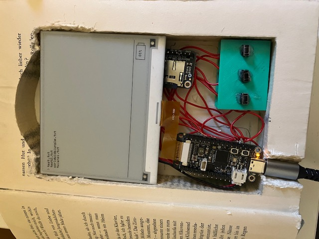

# The Infinite Book
An e-reader housed inside of an old hollowed out book!  

## Parts
-Adafruit feather ThinkInk RP2040  
-Adafruit microSD breakout board  
-2 pin push buttons (3)  
-PLA filament  
-Book (duh)  
-Adafruit 4.2" e-paper display  
-Wire  
-3.7v 500mAh LiPo battery  
-1kohm resistors (2)
## How it Works  
The e-reader functions are quite simple. To add books, upload them to the micro SD and they will appear once the card is inserted and the device is rebooted. There are left and right navigation buttons, as well as a select button that both selects a book and returns home when inside the book viewer. If none of the buttons are clicked in five minutes, the device will enter sleep mode, in which the display turns off until a button is pressed. You can view a demo of the project [here.](https://vimeo.com/1230736571?share=copy&fl=sv&fe=ci)
## How it Was Made
The software of the e-reader was coded in the Arduino IDE. The core libraries it utilizes are the GxEPD2 and SD libraries. The hardware was first tested on breadboards, then all the components besides the buttons were wired together. After, a dremel was used to create some holes in the fake book body being used to allow the screen to fit as well as to give access to the charging port. Finally, the buttons were put on a printed plate, glued shut, wird, and mounted in the book with velcro. The microcontroller and battery are also mounted with velcro, while the display is not secured but fits tightly and the microSD is wired but can be pulled out and moved freely to provide easy access to the card.
## Credits/Additional Info
This project was made for Hack Club Stardance. AI was used sometimes in development, to debug and improve code. Overall the project is said on Hackatime to have taken about 17 hours to create, although that number is probably closer to 20 or 21 hours since I didn't Lapse most of the physical build process.
